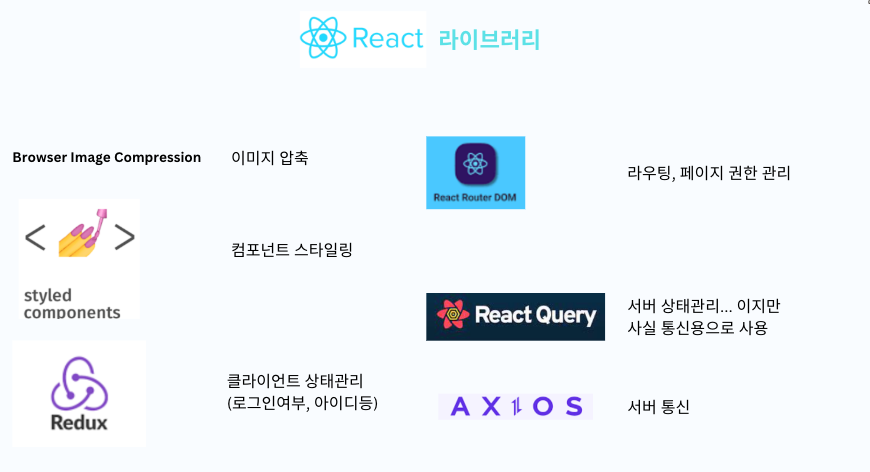

# 항구 블로그 토이프로젝트

## 진행중인 프로젝트 입니다. ~23.07.20 까지 완료

### FE React 김태현

### BE Spring 박서윤 김민규

### yarn CRA => VITE 로 변경 (속도, env세팅 편의성 고려) => yarn CRA 로 변경 (VITE의 불안정성, 사진업로드 문제)

### flatland.shop으로 라우팅.

https://flatland.shop/

#### S3, CloudFront, Route53 사용

